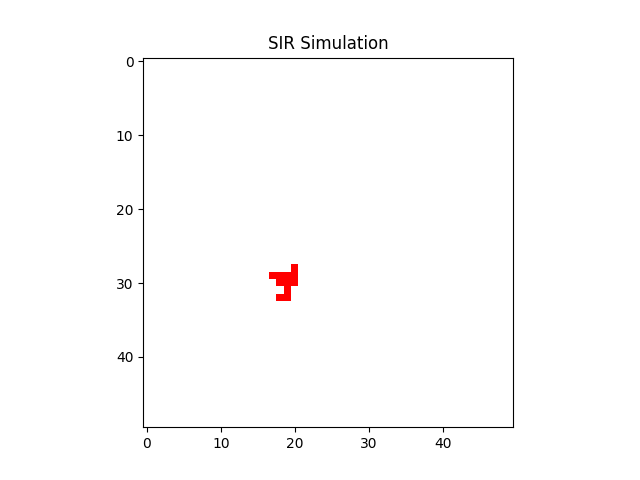

# SIR Model Simulation (Python)

This project was developed as an extension of a C++-based SIR simulation implemented in a university course, improving usability by integrating visualization directly into the simulation.

---

## Demo


---

## Overview

This project simulates the spread of an infectious disease using the SIR (Susceptible–Infected–Recovered) model on a 2D grid.

Each cell represents an individual, and the infection spreads to neighboring cells based on probabilistic rules. The simulation visualizes:

- Time evolution of S, I, R ratios (graph)
- Spatial spread of infection (animation)

---

## Features

- Grid-based SIR simulation (cellular automaton style)
- Probabilistic infection and recovery
- CSV output of S/I/R ratios over time
- Graph visualization using matplotlib
- Animated visualization of infection spread (GIF)

---

## Model Description

Each cell can be in one of three states:

- **S** (Susceptible)  
- **I** (Infected)  
- **R** (Recovered)

### Transition rules

- **S → I (infection)**  
  Depends on the number of infected neighbors  
  P(infection) = 1 - (1 - β)^n  
  where:
  - β: infection rate  
  - n: number of infected neighbors  

- **I → R (recovery)**  
  Occurs with probability γ  

- **R → R**  
  Remains recovered  

---

## Parameters

| Parameter | Description | Value |
|----------|------------|------|
| β (BETA_RATE) | Infection rate | 0.3 |
| γ (GAMMA_RATE) | Recovery rate | 0.05 |
| Grid size | Simulation space | 50 × 50 |

---

## Output

### 1. CSV file
`sir.csv`

- step  
- S ratio  
- I ratio  
- R ratio  

### 2. Graph
`sir_graph.png`  
Shows time evolution of S, I, R.

### 3. Animation
`sir_animation.gif`  
Shows spatial spread of infection over time.

---

## How to Run

```bash
# create virtual environment
python3 -m venv venv
source venv/bin/activate

# install dependencies
pip install matplotlib pandas pillow

# run
python sir_simulation.py
```
---
## Key Implementation Points
- Used a 2D grid to model spatial interactions  
- Implemented neighbor-based infection logic  
- Separated logic into functions:
  - update_board
  - calc_SIR
  - animate_sir
- Used matplotlib for both static and dynamic visualization  

---

## What I Learned

- How to translate a mathematical model (SIR) into an executable simulation  
- The difference between C++ and Python in terms of development speed and readability  
- The advantage of integrating simulation and visualization for rapid experimentation  
- Data visualization using matplotlib (both static plots and animations)  
- Managing Python environments (venv) and handling dependencies  
- Debugging and iteratively improving code structure  

---

## Future Improvements

- Compare simulation results under different parameters (β, γ)  
- Run multiple simulations and compute averages to reduce randomness  
- Optimize computation using NumPy for better performance  
- Add interactive parameter controls (e.g., sliders)  
- Improve visualization (color mapping, UI, real-time display)  